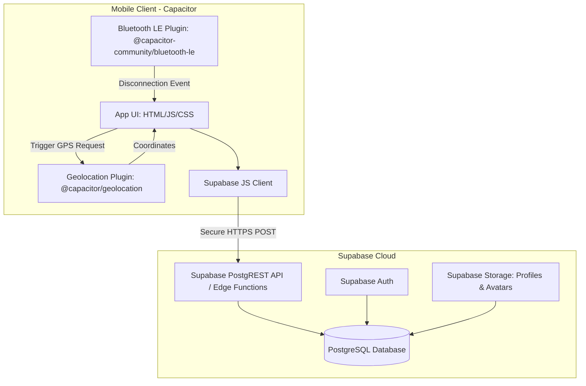
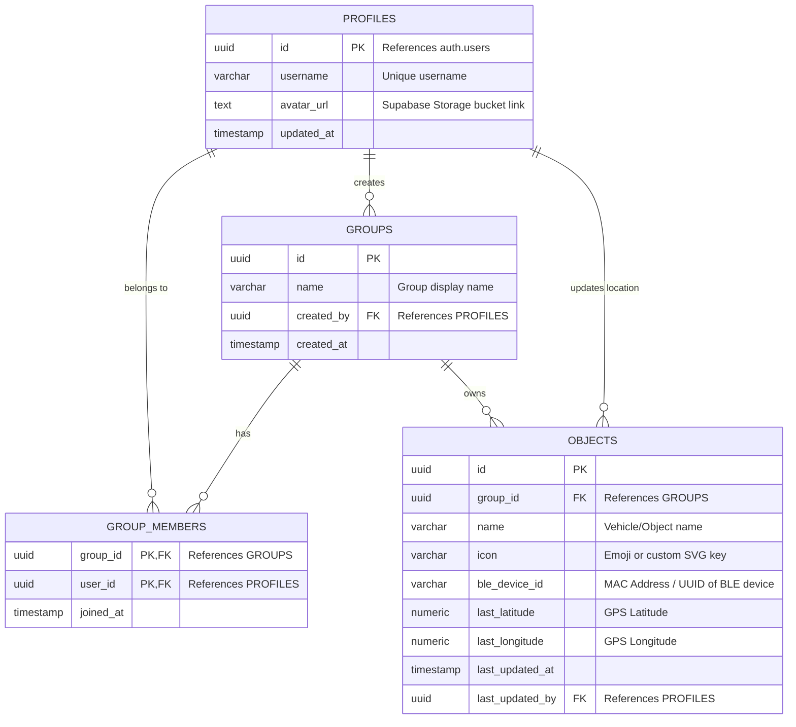
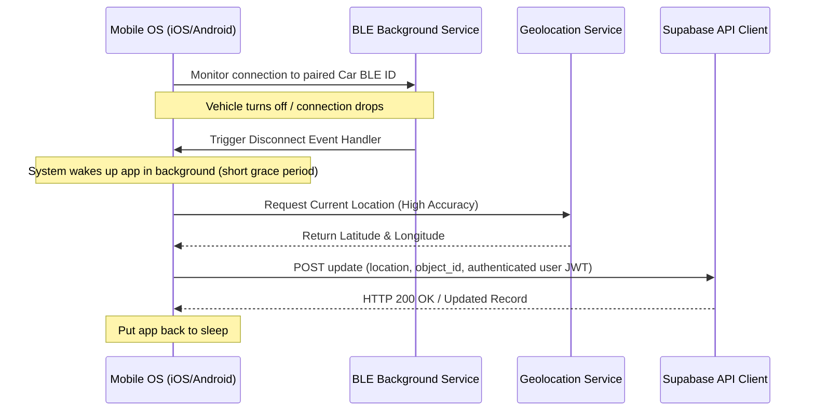

# App Architecture: SharedParking

## 1. System Topology & Technology Stack

The SharedParking application is a cross-platform mobile app compiled using **CapacitorJS**. It interfaces with native device APIs for Bluetooth LE and GPS Geolocation, communicating with a **Supabase** backend.



### Frontend Stack
1. **Core Runtime:** HTML5, CSS3, JavaScript (TypeScript recommended).
2. **Native Bridge:** [Capacitor](https://capacitorjs.com/) (v6+) to package the web app as native iOS and Android packages.
3. **Bluetooth LE Plugin:** `@capacitor-community/bluetooth-le` to scan, pair, connect, and monitor connections to car Bluetooth systems.
4. **Geolocation Plugin:** `@capacitor/geolocation` (coupled with native background location handlers if required) to capture precise GPS coordinates.
5. **Styling:** Vanilla CSS with custom modern properties (variables), gradients, responsive flexbox/grid layouts, and sleek dark modes.

### Backend Stack
1. **Supabase Database (PostgreSQL):** Relational storage mapping users, groups, objects, and coordinate histories.
2. **Supabase Auth:** Manage user sessions, credentials, and token-based database access (JWT).
3. **Supabase Storage:** Storage bucket named `avatars` for storing user profile pictures.
4. **Row Level Security (RLS):** Policies to ensure users can only view or modify objects belonging to groups they are active members of.
5. **Supabase Edge Functions (Optional but Recommended for POST requests):** A secure REST endpoint to handle the location post-request directly, verifying the sender via authentication headers.

---

## 2. Database Schema

The relational schema maps out the relationship between users, groups, and tracked vehicles.



### PostgreSQL DDL Script
```sql
-- Enable UUID extension if not already enabled
create extension if not exists "uuid-ossp";

-- 1. Profiles Table (linked to Supabase Auth)
create table public.profiles (
  id uuid references auth.users on delete cascade primary key,
  username varchar(255) unique not null,
  avatar_url text,
  updated_at timestamp with time zone default timezone('utc'::text, now()) not null
);

-- Enable RLS on Profiles
alter table public.profiles enable row level security;

-- 2. Groups Table
create table public.groups (
  id uuid default gen_random_uuid() primary key,
  name varchar(255) not null,
  created_by uuid references public.profiles(id) on delete set null,
  created_at timestamp with time zone default timezone('utc'::text, now()) not null
);

alter table public.groups enable row level security;

-- 3. Group Members Table (Many-to-Many join)
create table public.group_members (
  group_id uuid references public.groups(id) on delete cascade,
  user_id uuid references public.profiles(id) on delete cascade,
  joined_at timestamp with time zone default timezone('utc'::text, now()) not null,
  primary key (group_id, user_id)
);

alter table public.group_members enable row level security;

-- 4. Objects Table (e.g. cars, keys)
create table public.objects (
  id uuid default gen_random_uuid() primary key,
  group_id uuid references public.groups(id) on delete cascade not null,
  name varchar(255) not null,
  icon varchar(50) default '🚗' not null, -- Emojis or asset identifiers
  ble_device_id text, -- Paired BLE UUID/MAC Address
  last_latitude numeric(10, 8),
  last_longitude numeric(11, 8),
  last_updated_at timestamp with time zone,
  last_updated_by uuid references public.profiles(id) on delete set null
);

alter table public.objects enable row level security;
```

---

## 3. Bluetooth LE & Geolocation Background Operations

Modern operating systems (iOS and Android) strictly regulate background activities (Bluetooth scanning/connections and GPS location tracking) to preserve battery life. To ensure reliable parking tracking, the app must configure native permissions and modes.

### A. Sequence of Disconnection Hook


### B. OS Native Configurations
To allow background operation, specific configurations are required:

#### iOS Configurations (`info.plist`)
* **Background Modes (`UIBackgroundModes`):**
  * `bluetooth-central`: Allows the app to interact with Bluetooth accessories while in the background.
  * `location`: Enables location updates in the background.
* **NS Privacy Usage Descriptions:**
  * `NSBluetoothAlwaysUsageDescription`: Reason for using Bluetooth (e.g., "We monitor your car's Bluetooth to auto-save parking locations").
  * `NSLocationWhenInUseUsageDescription`: Reason for using GPS.
  * `NSLocationAlwaysAndWhenInUseUsageDescription`: Required for background GPS updates when disconnected.

#### Android Configurations (`AndroidManifest.xml`)
* **Permissions:**
  * `<uses-permission android:name="android.permission.BLUETOOTH" />`
  * `<uses-permission android:name="android.permission.BLUETOOTH_ADMIN" />`
  * `<uses-permission android:name="android.permission.BLUETOOTH_CONNECT" />` (Android 12+)
  * `<uses-permission android:name="android.permission.ACCESS_FINE_LOCATION" />`
  * `<uses-permission android:name="android.permission.ACCESS_BACKGROUND_LOCATION" />` (Needed for background tracking)
  * `<uses-permission android:name="android.permission.FOREGROUND_SERVICE" />` (To spin up a sticky service mapping connection states)

---

## 4. Security & Row Level Security (RLS)

To prevent users from viewing or updating other groups' cars, Row Level Security is configured.

### RLS Policies Example
```sql
-- Helper function to check group membership
create or replace function public.is_group_member(group_id uuid, user_id uuid)
returns boolean security definer as $$
begin
  return exists (
    select 1 from public.group_members
    where group_members.group_id = is_group_member.group_id
      and group_members.user_id = is_group_member.user_id
  );
end;
$$ language plpgsql;

-- 1. Objects Table Policies
-- Allow members to view objects in their groups
create policy "Allow group members to view objects" on public.objects
  for select using (
    public.is_group_member(group_id, auth.uid())
  );

-- Allow members to update location of objects in their groups
create policy "Allow group members to update objects" on public.objects
  for update using (
    public.is_group_member(group_id, auth.uid())
  );
  
-- Allow group members to insert objects
create policy "Allow group members to insert objects" on public.objects
  for insert with check (
    public.is_group_member(group_id, auth.uid())
  );

---

## 5. Internationalization & Localization (i18n)

The SharedParking application is configured for multi-language support (English and Spanish). Localization is handled on the client-side to minimize network overhead and ensure instantaneous language switching without page reloads.

### A. Architecture details
- **Dictionary Module (`src/i18n.js`):** Contains translation definitions for English (`en`) and Spanish (`es`).
- **Dynamic DOM updates:** Elements that contain static text are configured with custom `data-i18n` attributes mapping to a translation key. Inputs use `data-i18n-placeholder`, and tooltips or interactive buttons use `data-i18n-title` and `data-i18n-label`.
- **Preference Persistence:** The user's active language choice is saved locally to `localStorage` under the key `shared_parking_lang`. On boot, the app detects saved settings or falls back to browser preferences (`navigator.language`).
- **Synchronized Rerendering:** When a user changes the language in the sidebar dropdown, `translateDOM()` scans and translates the static interface immediately. A callback in `main.js` re-renders dynamic database items (like list accordions and map markers) using localized dictionary values.

### B. Directory Structure
```
src/
├── i18n.js             # Translation dictionary objects and utility logic
├── main.js             # Initializes translation module and binds re-render hooks
├── ui.js               # Binds language select buttons and localizes dialogs
└── map.js              # Translates dynamic Leaflet popup elements
```
```
